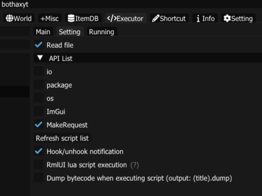

# SCRIPT | ZAXPLOIT
- **Setting For BHax**
  
  
- **How To Use (bothax)**
```lua
-- Choose sc and copy raw link
-- ZaXploit
link = "https://raw.githubusercontent.com/zaxgrow/ZAX_SCRIPT_GROWTOPIA/refs/heads/main/beefBot.lua"
load(MakeRequest(link).content)()
```
**Discord ZaXploit:**
**https://discord.com/invite/Q3uNB7xG29**

